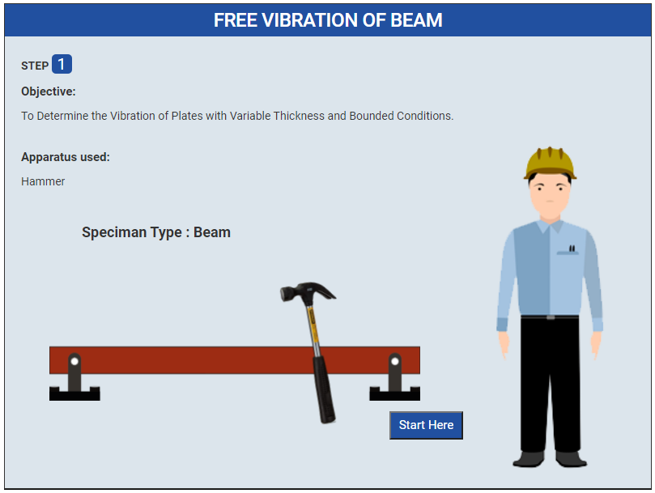
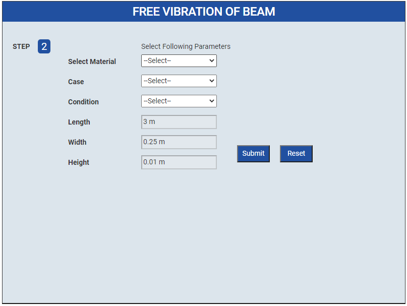
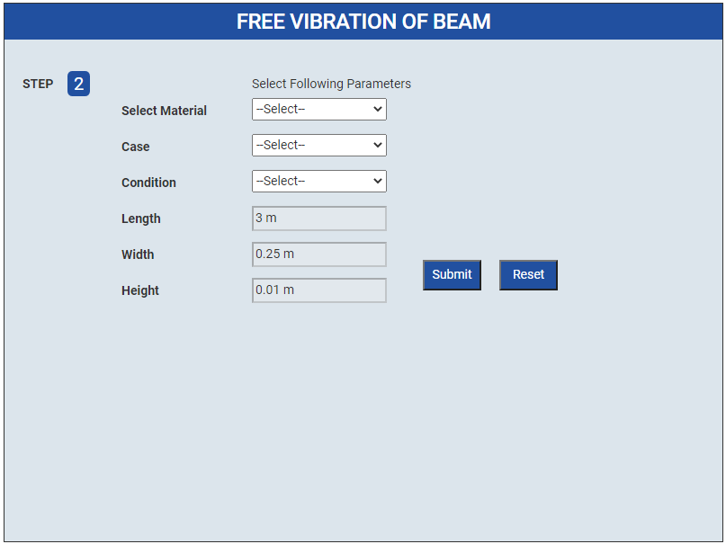
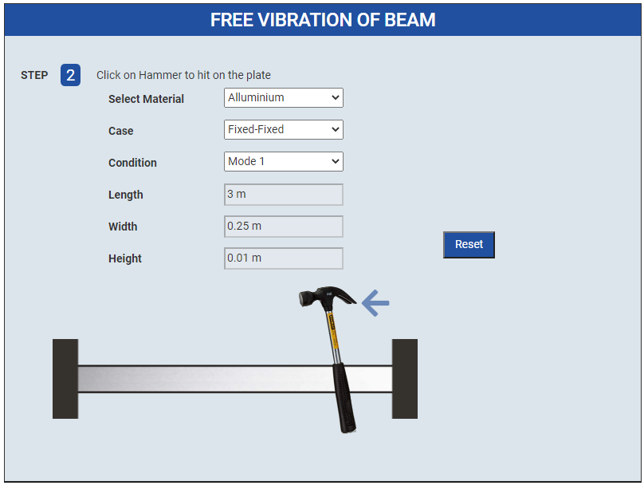
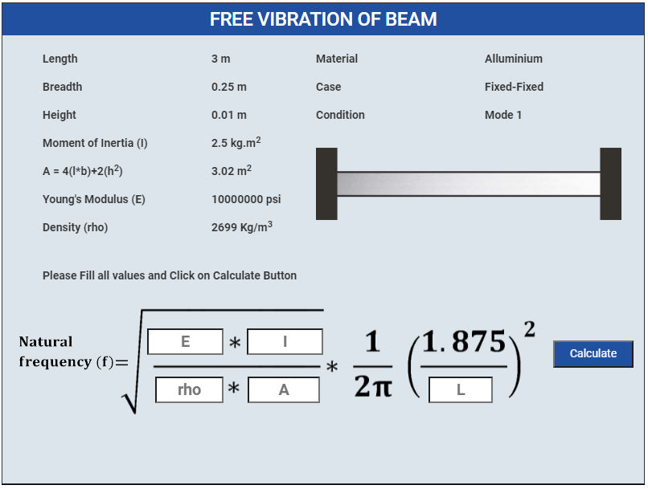
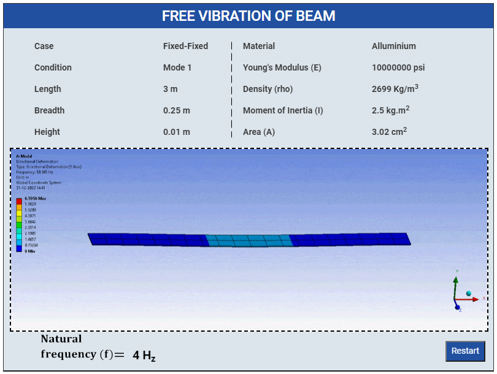

### Procedure

1. Click on Start Here button to start the experiment.
 

2. Select following parameters
 

3. After select all parameters and click submit button
 

4. After Submitting values Click on Hammer to hit on the beam
 

5. Please Fill all values these are given and Click on Calculate Button
 

6. After that click on Show Graphs button

Graph

