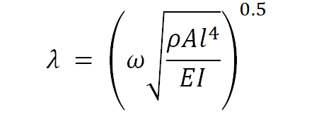
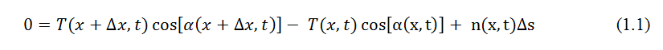
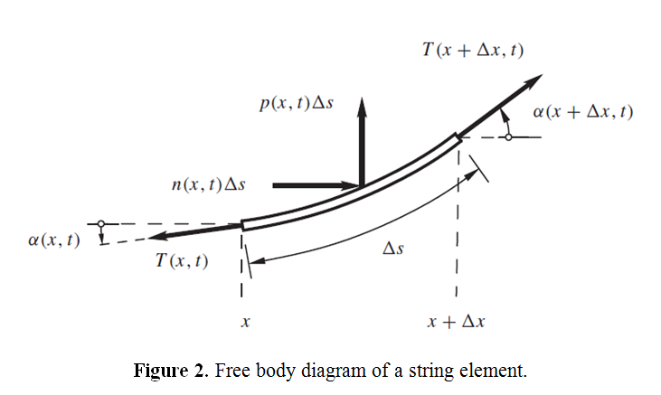
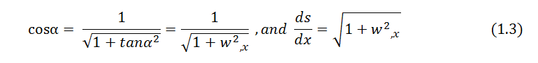
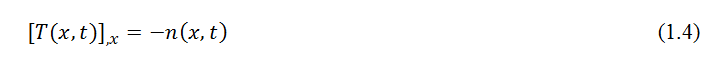
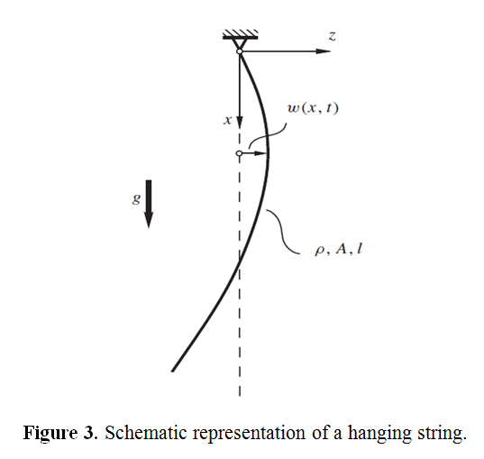
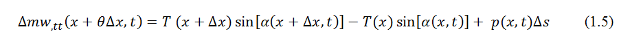
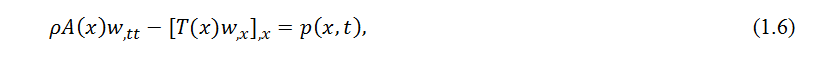
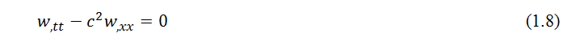

### EXPERIMENTAL METHODOLOGY

<strong>nthNatural frequency

</strong>

E = young's Modulus (MPa)

I = Moment of Inertia (mm4)

&#961; = Density (kg/m3)

A = Area (mm2)

l = length of beam (m)

| Sr. No      | End Conditions   |  |
| :---    |    :---       |   :---        |
| 1       | Pinned-Pinned | &#955;_1  = &#928;;  &#955;_2  = 2&#928;;  &#955;_3  = 3&#928;   |
| 2       |	Free-Free    | &#955;_1  = 4.7300;  &#955;_2  = 7.8532;  &#955;_3  = 10.9956      |
| 3       | Fixed-Fixed   | &#955;_1  = 4.7300;  &#955;_2  = 7.8532;  &#955;_3  = 10.9956     |
| 4       | Fixed-Free    | &#955;_1  = 1.8751;  &#955;_2  = 4.6940;  &#955;_3  = 7.8547 (&#955; = 0 for rigid body mode)   |
| 5       | Fixed-Pinned  | &#955;_1  = 3.9266;  &#955;_2  = 7.0685;  &#955;_3  = 10.2101      |
| 6       | 	Pinned-Free  | &#955;_1  = 3.9266;  &#955;_2  = 7.0685;  &#955;_3  = 10.2101  (&#955; = 0 for rigid body mode)     |
<!-- Consider an infinitesimal element of the plate in polar coordinates as shown in Fig. 1.1. In this figure the radial moment Mr, tangential moment M&#952;, twisting moments Mr&#952; and Mr, and the transverse shear forces Qr and Q&#952;, are shown on the positive and negative edges of the element.

The equations of motion of the plate can be derived in polar coordinates by considering the
dynamic equilibrium of the element shown in Fig. 1.1 as follows: Moment equilibrium about the
tangential (&#952;) direction:

Moment equilibrium about the radial (R) direction:

Force equilibrium in the z direction:

Equations (1.1)-(1.3) can be combined to derive a single equation of motion in terms of the
moment resultants Mr, M&#952;, and Mr&#952;,By substituting the moment resultants in terms of the
transverse displacement w, the final equation of motion, shown in Eq. (1.16), can be obtained.

The coordinate transformation technique can also be used to derive the equation of motion in polar coordinates from the corresponding equation in Cartesian coordinates, as indicated below.

<strong>

1.2 Transformation of Relations

</strong>

The Cartesian and polar coordinates of a point P are related as (Fig. 1.2)

From Eqs. (1.5) and (1.6), we obtain

Similarly, Eqs. (1.6) and (1.4) give

Since the deflection of the plate w is a function of r and &#952;, the chain rule of differentiation yields

For the expressions &#8706;2w &#8725; &#8706;x2, &#8706;2
w &#8725; &#8706;x&#8706;y , and &#8706;
2w &#8725; &#8706;y2, the operations &#8706;/&#8706;x and &#8706;/&#8706;y of
Eqs. (1.9) and (1.10) are repeated to obtain

By adding Eqs. (1.11) and (1.12), we obtain

By repeating the operation &#8711;2
twice, we can express

Using Eqs. (1.9), (1.10), and (1.11) in the equation of motion for the forced transverse vibration
of a circular plate can be expressed as

1.3 Moment and Force Resultants
Using the transformation procedure, the moment resultant - transverse displacement relations can
be obtained as:

Similarly, the shear force resultants can be expressed as

The effective transverse shear forces can be written as

Note that the Laplacian operator appearing in Eqs. (1.20) - (1.23) is given in polar coordinates by
Eq. (1.14).
1.4 Boundary Conditions
1. Clamped, fixed, or built-in edge. The deflection and slope (normal to the boundary) must be
zero:

where r denotes the radial (normal) direction to the boundary.

2. Simply supported edge. The deflection and bending moment resultant must be zero:

3. Free edge. The bending moment resultant and the effective shear force resultant on the edge must be zero:

4. Edge supported on elastic springs. If the edge is supported on linear and torsional springs all
around as shown in Fig. 1.3, the boundary conditions can be stated as follows:

 -->
<!-- 
 
 
 

where &#8733;(x,t) represents the angle between the tangent to the string at x and the x-axis, as shown in Figure 2. Dividing both sides of (1.1) by &#8710;x and taking the limit &#8710;x &#8594;0 yields

 

where [.],x represents partial derivative with respect to x. From geometry, one can write

 

Substituting (1.3) in (1.2), and assuming w,x &#8810; 1, yields on simplification

 

Therefore, when n(x,t) &#8801; 0, equation (1.4) implies that the tension T (x,t) is a constant. On the other hand, for a hanging string, shown in Figure 3, one has n(x,t) = &#961;A(x)g, where &#961; is the density, A is the area of cross-section, and g is the acceleration due to gravity. Then, using the boundary condition of zero tension at the free end, i.e., T (l,t) &#8801; 0 (for constant &#961;A), (1.4) yields T (x,t) = &#961;Ag (l - x). in general, the tension in a string may also depend on time. However, in the following discussions, it will be assumed to depend at most on x.

 

Figure 3. Schematic representation of a hanging string.
Now, consider the transverse dynamics of the string element shown in Figure 1. The equation of motion of the small element in the transverse direction can be written from Newton’s second law of motion as

 

where &#8710;m is the mass of the element, &#952; &#8712;[0,1], and (.),tt indicates double partial differentiation with respect to time. Again assuming  w,x.&#8810;1 one can write sin&#8733;  &#8776; tan&#8733; =  w,x. Further, &#8710;m = &#961;A(x)&#8710;s. Using these expressions in (1.5) and dividing by &#8710;x on both sides, one can write after taking the limit &#8710;x &#8594; 0

 

where, based on the previous considerations, we have assumed ds/dx  &#8776; 1. The linear partial differential equation (1.6), along with (1.4), represents the dynamics of a taut string. When the external force is not distributed but a concentrated force acting at, say x = a, the forcing function on the right hand side of (1.6) can be written using the Dirac delta function as

 

where f(t)is the time-varying force, and  &#948;(.) represents the Dirac delta function.
An important particular form of (1.6) is obtained for p(x,t)  &#8801; 0, and T and &#961;A not depending on x. We can rewrite (1.6) as

 

where  c=&#8730;(T/&#961;A)  is a constant having the dimension of speed. This represents the unforced transverse dynamics of a uniformly tensioned string.  The hyperbolic partial differential equation (1.8) is known as the linear one-dimensional wave equation, and c is known as the wave speed. This implies that a disturbance created at any point on the string propagates with a speed c. It should be clear that the wave speed c is distinct from the transverse material velocity (i.e., the velocity of the particles of the string) which is given by w,t (x,t)  
The complete solution of the second-order partial differential equation (1.6) (or (1.8)) requires specification of two boundary conditions, and two initial conditions. For example, for a taut string shown in Figure 1, the appropriate boundary conditions are w (0,t)  &#8801; 0 and w (l,t)  &#8801; 0.  For the case of a hanging string, the boundary conditions are w (0,t)  &#8801; 0 and w (l,t) is finite.  The initial conditions are usually specified in terms of the initial shape of the string, and initial velocity of the string, i.e., in the forms w(x,0) = w0 (x),and w,t(x,0) = v0 (x), respectively. 

<a href="images/infinitecomplete.pdf" target="_blank">Infinite Complete</a>

<a href="images/infinitereverse.pdf" target="_blank">Infinite Reverse</a> -->
